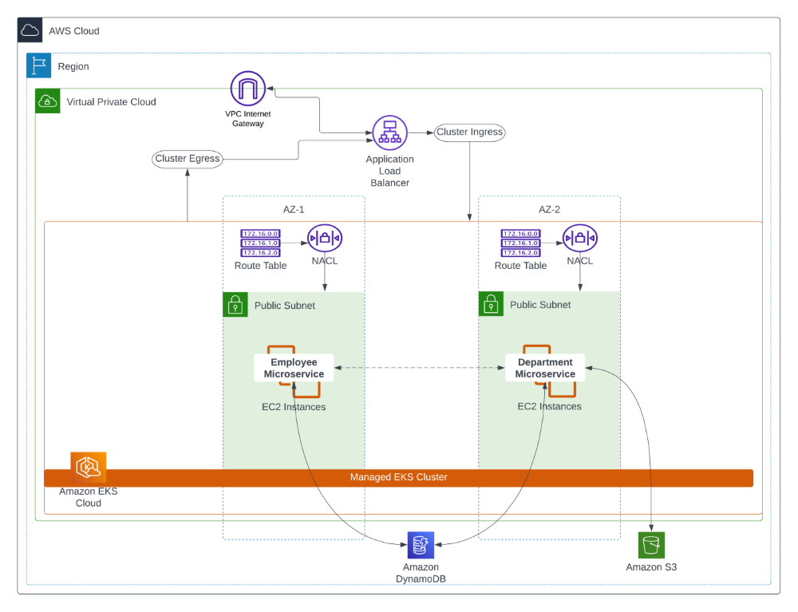

# Human Resources Microservice AWS Project
Welcome to the Employee Profiles REST API project, developed as an individually as part of the graduate-level Cloud Computing course at Seattle University. This project showcases the implementation of a Node.js-based RESTful API for managing employee profiles within a fictitious company. The API allows you to create, retrieve, update, and delete employee profiles, and also supports storing employee profile photos in Amazon S3.

- [Features](#features)
- [Built with](#built-with)

## Features
**Employee Profile Management**
- Create Profile: Easily create new employee profiles with essential information such as name, title, contact details, and more.

- Retrieve Profile: Retrieve detailed information about an employee using their unique identifier or by department.

- Update Profile: Update existing employee profiles to reflect changes in their information.

- Delete Profile: Delete employee profiles that are no longer needed.

**2. Employee Profile Photos**
- Photo Upload: Store employee profile photos securely in Amazon S3.

- Photo Retrieval: Retrieve and display employee profile photos through the API.

**3. Department API Integration**
- Stateful Data Exchange: Communicates with an internal Department Microservice to exchange stateful data related to employee profiles and departments.

**4. Scalability and Load Balancing**
- AWS Load Balancer: Distributed incoming traffic efficiently using an AWS Level 7 Load Balancer to ensure optimal performance.

- EKS Managed Cluster: Leveraged Amazon EKS managed Kubernetes cluster for scalability and management.

## Built With
- Node.js: The core API server is built using Node.js, providing a solid foundation for handling HTTP requests and responses.

- CloudFormation: A cloud infrastructure template to set up an Elastic Kubernetes Service (EKS) friendly Virtual Private Cloud (VPC).

- EC2Client, AWS JS SDK v3: Manage compute within the Kubernetes cluster, facilitating smooth communication and scaling.

- DynamoDBClient and DynamoDocumentClient: DynamoDBClient stores and manages employee profile data. DynamoDBClient and DynamoDocumentClient are used to interact with the database.

- S3Client, AWS JS SDK v3: For efficient storage of employee profile photos.

- AWS Level 7 LB and Controller: Configured with the AWS VPN to distribute incoming traffic to the managed Kubernetes cluster.

- Docker, DockerHub, Helm: For containerizatiation. 

- EKS Managed Cluster, kubectl. 

